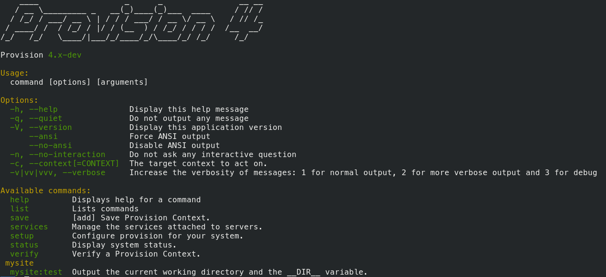

# Customizing Provision

## Docker Services

When using Provision's Docker services, a docker-compose.yml file is automatically generated, using pre-built images for Database & Web servers.

Each server has a "config path" where all server configuration is stored, such as apache config. Check `provision status` for the server config path. The server config folder is filled with files. Most files are generated automaticaly by provision verify. You can create the files labelled \(Optional\) below to customize the behavior of this server's stack.

```text
~/.config/provision/$SERVER_NAME
   /.env                            # Generated on provision verify. Includes the COMPOSE_FILE variable to include all found docker-compose yml files.
   /.env-custom                     # (Optional) Included in .env when it is generated. See https://docs.docker.com/compose/reference/envvars/ for available environment variables.
   /docker-compose-provision.yml    # Generated on provision verify
   /docker-compose*.yml             # (Optional) Additional files named docker-compose*.yml are detected and written to .env, so any calls to docker-compose in this directory load all files. 
   /.provision.yml                  # (Optional) YML file with hooks to run on verify.  
   /mysql.cnf                       # (Optional) MySQL configuration can be put into this file.*** 
   /php.ini                         # (Optional) Custom PHP configuration.****
   /php-cli.ini                     # (Optional) Custom PHP configuration for CLI only.
   /Dockerfile.http                 # (Optional) Custom dockerfile for the http service.*****
   /Dockerfile.db                   # (Optional) Custom dockerfile to use the db service.
   /apacheDocker.conf               # Generated on provision verify
   /apacheDocker            
     /platform.d                    # Generated Platform apache configs. 
     /pre.d                         # Custom Apache configs can be put in here.
     /post.d                        # Custom Apache configs can be put in here.
     /vhost.d                       # Generated Site virtualhost configs.
     /platform.d
   /RoboFile.php                    # Commands from a RoboFile here will be loaded into the provision CLI when using `provision @context`
```

\*\* The docker-compose command supports automatic merging of docker-compose.yml files, by passing multiple `-f` options. Provision detects if this file is present and automatically adds this for you when you run `provision verify`

\*\*\* mysql.cnf file must follow the right format:

```text
[mysqld]
max_allowed_packet    = 32M
```

\*\*\*\* The `php.ini` file \(if present\) is mapped to `/etc/php/7.0/apache2/conf.d/99-provision.ini` and the `php-cli.ini` file is mapped to `/etc/php/7.0/cli/conf.d/99-provision.ini`. Make sure it is also in the right format:

```text
memory_limit=512M
```

\*\*\*\*\* The http container requires a few specific things to work. You should use `FROM provision4/http` or `FROM provision4/http:php7` as your base image. See the [Dockerfile.user](https://github.com/provision4/provision/tree/8b7b5861bee30725a38967aceffa4b775ae85e1c/docs/dockerfiles/Dockerfile.user) file as an example Dockerfile. Copy to ~/.config/provision/$SERVER\_NAME/Dockerfile.http, then run `provision verify $SERVER_NAME` to build. If you wish to provide an entirely different http dockerfile, look at [Dockerfile.http.php7](https://github.com/provision4/provision/tree/8b7b5861bee30725a38967aceffa4b775ae85e1c/docs/dockerfiles/Dockerfile.http.php7) to learn the requirements. As long as your image has the web server configuration links and the correct sudoers file, Provision shopuld be able to use it.

#### Remember...

After modifying any optional configuration files, run `provision verify` on your server to enable the changes.

## Hooks Files

### .provision.yml

You can put a file called `.provision.yml` in the root of a site, or in the server config folder.

Currently only "pre-verify" hooks are possible.

The format should be like so:

```text
hooks:
  verify:
    pre: |
      echo "Do something here before verifying anything."
      echo "You can use the 'env' command to see what environment variables are available."
      echo "Commands are run on the host. If you need to run a command inside a container, use something like:"
      echo "docker-compose exec http $COMMAND"
      env

      echo "Increasing PHP's memory_limit..."
      echo "memory_limit=512M" > php.ini
```

There are a few environment variables you might find helpful:

* `PROVISION_CONTEXT` - The name of the server context providing HTTP service.
* `PROVISION_CONTEXT_CONFIG_FILE` - The path on the host to this context's YML configuration file.
* `PROVISION_CONTEXT_SERVER_HTTP` - The name of the server context providing HTTP service.
* `PROVISION_CONTEXT_SERVER_HTTP_CONFIG_PATH` - Full path on the host to the HTTP server's configuration. This is the folder the `docker-compose.yml` file is in. \(If this is a server context, the hooks are run in this folder.\)

## Robo Files

Provision can now include `RoboFile.php` files from your server config path or site codebase.

Robo is a task runner written in PHP. Provision 4.x includes Robo. If you create a RoboFile.php in your site's root, Provision will include those commands in the main `provision` command.

1. Change directory to your site root or server config root.
2. Create a file named `RoboFile.php` with the following:

   ```php
    <?php
    /**
     * This is project's console commands configuration for Robo task runner.
     *
     * @see http://robo.li/
     */
    class RoboFile extends \Robo\Tasks
    {
        /**
         * Output the current working directory and the __DIR__ variable.
         */
        public function mysiteTest() {
            $this->say("CWD: " . getcwd());
            $this->say("__DIR__: " . __DIR__);
        }
    }
   ```

   NOTE: If you have the `robo` command [installed globally](https://robo.li), you can run `robo init` to create this file.

3. Run 

   `provision @mycontextname`

    and you will see your commands listed:

   

   You can now run this command from any directory if you specify the right context name.

4. Since this is just a `RoboFile.php` you can also run it with the `robo` command, if you have it installed. Just be aware that if you are using Provision to run the commands, you shouldn't rely on `getcwd()` if you need the directory of the RoboFile. Use `__DIR__` instead.

